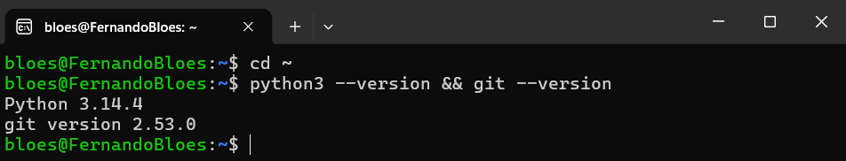
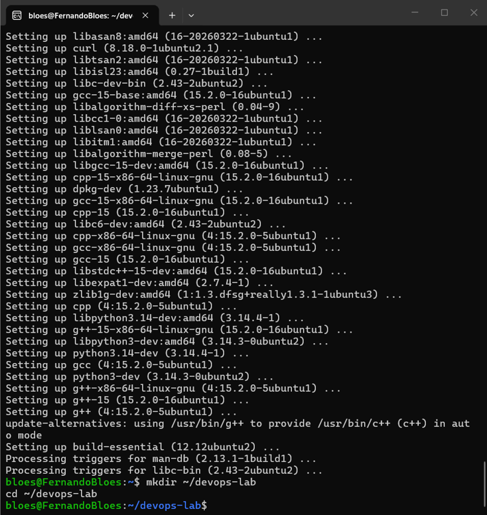
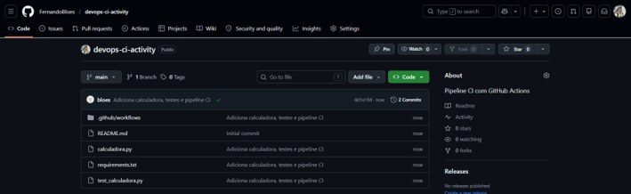
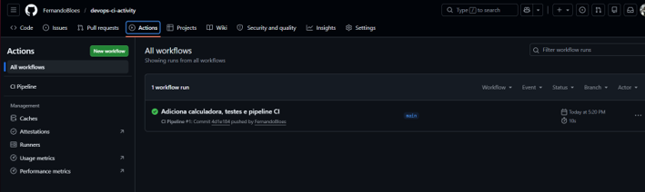
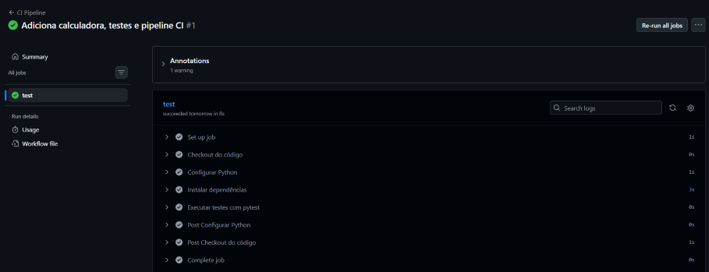
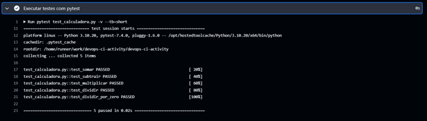
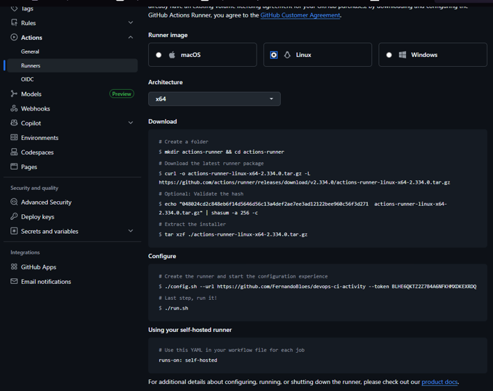
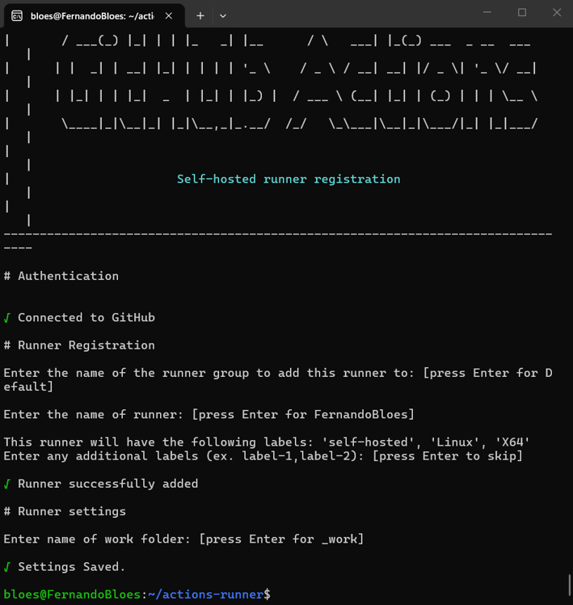
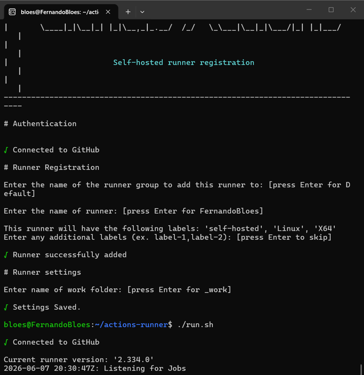
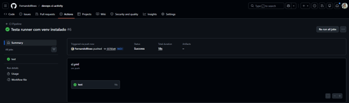

# Pipeline CI com GitHub Actions

## 1. Introdução

Este projeto implementa um pipeline de Integração Contínua (CI) utilizando GitHub Actions com runner auto-hospedado no Ubuntu via WSL2.

## 2. Ambiente Utilizado

- **Sistema Operacional:** Ubuntu 26.04 (WSL2 no Windows)
- **Python:** 3.14.4
- **Git:** 2.53.0
- **GitHub Actions Runner:** 2.334.0
- **Runner tipo:** Self-hosted

## 3. Estrutura do Repositório

devops-ci-activity/
├── calculadora.py
├── test_calculadora.py
├── requirements.txt
├── screenshots/
└── .github/
    └── workflows/
        └── ci.yml

## 4. Desenvolvimento

### Parte 1 — Preparação do Servidor Ubuntu

### Parte 2 — Estrutura do Repositório

### Parte 3 — Pipeline GitHub Actions

### Parte 4 — Runner Self-Hosted

## 5. Problemas Encontrados

| Problema | Solução |
|----------|---------|
| Python 3.10 não disponível no Ubuntu 26.04 | Removido o step setup-python, usado Python do sistema |
| pip bloqueado por ambiente gerenciado | Criado virtualenv com python3-venv |
| python3-venv não instalado | Instalado via sudo apt install python3.14-venv |

## 6. Conclusão

O pipeline CI foi implementado com sucesso, executando automaticamente a cada git push, rodando 5 testes com pytest e utilizando runner self-hosted no Ubuntu via WSL2.
